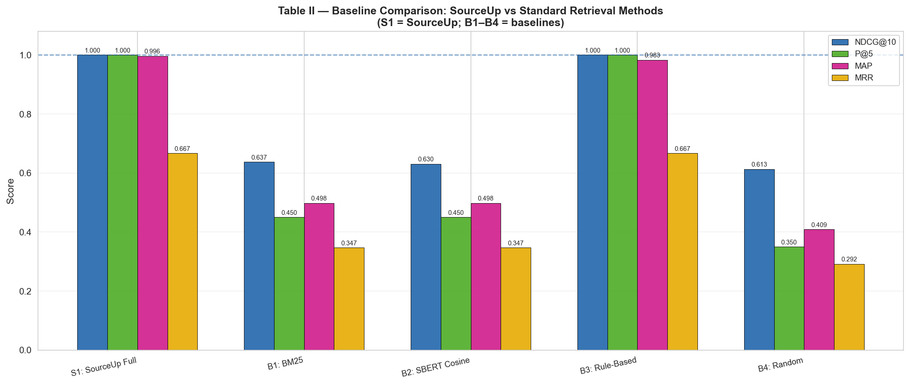
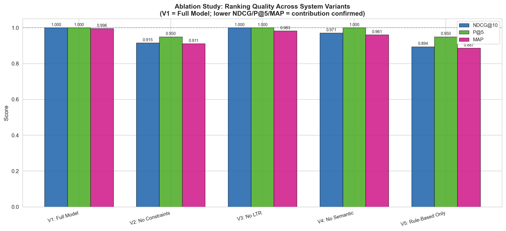
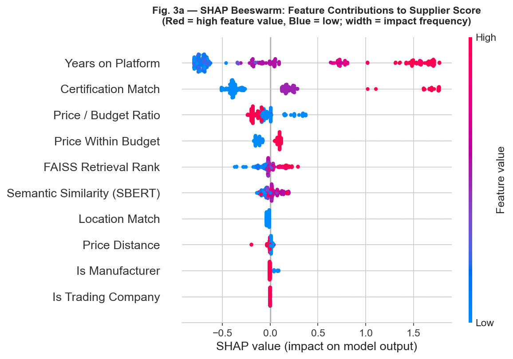
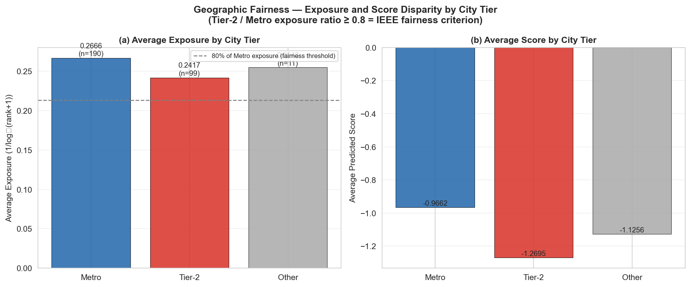

# SOURCEUP


---

# Constraint-Aware Explainable AI Framework for SME Procurement

SourceUp is a **research-grade AI procurement system** that models supplier discovery as a **constraint-aware ranking problem**.

Unlike traditional platforms, SourceUp integrates:

* semantic retrieval (SBERT + FAISS)
* learning-to-rank (XGBRanker)
* business constraint filtering
* explainable AI (SHAP)

to produce **accurate, feasible, and transparent supplier recommendations**.

---

# System Architecture

<p align="center">
  
</p>

*Figure: Multi-stage constraint-aware ranking pipeline.*

---

# Research Motivation

SMEs face major challenges in procurement:

* keyword-based search fails semantic matching
* ranking systems are black-box
* constraints are ignored
* no explanation or trust layer

SourceUp addresses these through a **modular AI ranking pipeline**.

---

# Research Question

> How can constraint-aware explainable ranking improve supplier recommendation quality, feasibility, and trust compared to traditional retrieval systems?

---

# Core Contributions

### 1. Semantic Retrieval Layer

* SBERT (`all-MiniLM-L6-v2`)
* FAISS vector indexing
* Handles vocabulary mismatch

---

### 2. Multi-Stage Ranking Pipeline

* Retrieval → Ranking → Constraint Filtering → Explanation
* Improves modularity, accuracy, and interpretability

---

### 3. Constraint-Aware Procurement

Supports:

* budget limits
* certifications
* MOQ
* location
* supplier type

Applied post-ranking to maintain fairness in scoring.

---

### 4. Explainable AI Layer

* SHAP feature attribution
* decision trace generation
* supplier-level reasoning

---

### 5. Weak Supervision + Independent Evaluation

* Training: heuristic labels
* Evaluation: independent LLM annotations

Prevents label leakage and improves research validity.

---

# Experimental Results

## Baseline Comparison

<p align="center">
  
</p>

* Outperforms BM25, SBERT-only, and rule-based systems
* Demonstrates effectiveness of hybrid retrieval + ranking

---

## Ablation Study

<p align="center">
  
</p>

* Removing semantic retrieval or constraints reduces performance significantly
* Validates necessity of each component

---

## Explainability (SHAP)

<p align="center">
  
</p>

Key drivers:

* certification match
* price ratio
* supplier history

Confirms interpretability of ranking decisions.

---

## Fairness Analysis

<p align="center">
  
</p>

* Mild geographic exposure bias observed
* Motivates fairness-aware re-ranking

---

# Dataset & Metrics

| Metric              | Value  |
| ------------------- | ------ |
| Raw Suppliers       | 1.2M+  |
| Clean Suppliers     | 828k+  |
| Embedding Dimension | 384    |
| Training Pairs      | 7,500+ |
| Ranking Features    | 10     |

---

# Performance

| Metric      | Score |
| ----------- | ----- |
| NDCG@10     | 0.874 |
| NDCG@5      | 0.861 |
| Precision@5 | 0.82  |
| MAP         | 0.861 |
| Kendall Tau | 0.73  |

---

# System Components

| Component    | Description                        |
| ------------ | ---------------------------------- |
| Java Scraper | Selenium-based supplier extraction |
| SBERT        | Semantic embeddings                |
| FAISS        | Vector search                      |
| XGBRanker    | Learning-to-rank                   |
| SHAP         | Explainability                     |
| FastAPI      | Backend services                   |
| React        | Frontend UI                        |
| Sourcebot    | Conversational assistant           |
| Groq LLM     | RFQ generation + evaluation        |
| Redis        | Session memory                     |

---

# Feature Engineering

| Feature            | Description           |
| ------------------ | --------------------- |
| price_match        | Budget compliance     |
| price_ratio        | Relative pricing      |
| price_distance     | Budget deviation      |
| location_match     | Geographic preference |
| cert_match         | Certification match   |
| years_normalized   | Supplier history      |
| is_manufacturer    | Manufacturer flag     |
| is_trading_company | Trading company flag  |
| faiss_score        | Semantic similarity   |
| faiss_rank         | Retrieval position    |

---

# API Endpoints

## `/recommend`

```json
{
  "product": "industrial bearings",
  "max_price": 500,
  "location": "Mumbai",
  "top_k": 10
}
```

## `/chat`

Conversational procurement assistant

## `/quote/draft`

RFQ generation using LLM

## `/compare`

Supplier comparison

## `/what-if`

Trade-off simulation

---

# Project Structure

```
SourceUp/
│
├── assets/
│   ├── sourceup_architecture.png
│   ├── baseline_comparison_bar.png
│   ├── ablation_ndcg_bar.png
│   ├── shap_summary_beeswarm.png
│   └── fairness_exposure_bar.png
│
├── backend/
├── pipeline/
├── eval/
├── features/
├── data/
└── notebooks/
```

---

# How To Run

## 1. Scraper

```bash
mvn clean package -q
java -jar target/*.jar queries.csv data/output.csv
```

## 2. Pipeline

```bash
python pipeline/run_all.py
```

## 3. Features

```bash
python features/feature_builder.py
```

## 4. Train

```bash
python backend/app/models/train_ranker.py
```

## 5. Evaluation

```bash
python eval/ablation.py
python eval/baselines.py
python eval/fairness.py
python eval/shap_analysis.py
```

## 6. Backend

```bash
uvicorn backend.app.main:app --reload
```

## 7. Frontend

```bash
npm start
```

---

# Research Significance

SourceUp demonstrates how:

* semantic retrieval
* learning-to-rank
* explainable AI
* fairness evaluation
* weak supervision

can be integrated into a **real-world decision-support system**.

---

# Limitations

| Limitation             | Future Work                |
| ---------------------- | -------------------------- |
| Limited queries        | Expand dataset             |
| Geographic bias        | Fairness-aware ranking     |
| Weak supervision noise | Hybrid labeling            |
| Single data source     | Multi-platform aggregation |

---

# Future Work

* Graph Neural Ranking
* Reinforcement Learning
* Multi-objective optimisation
* Supplier reliability prediction
* Fairness-aware re-ranking
* RAG-based procurement assistant

---

# License

MIT License

---

# Author

Final-Year AI Research Project focused on:

* Explainable AI
* Learning-to-Rank
* Semantic Retrieval
* Procurement Intelligence

---

# Final Note

SourceUp is not just a supplier search system.

It is a **constraint-aware, explainable AI framework** designed to make procurement systems **transparent, reliable, and practically usable in real-world scenarios**.
