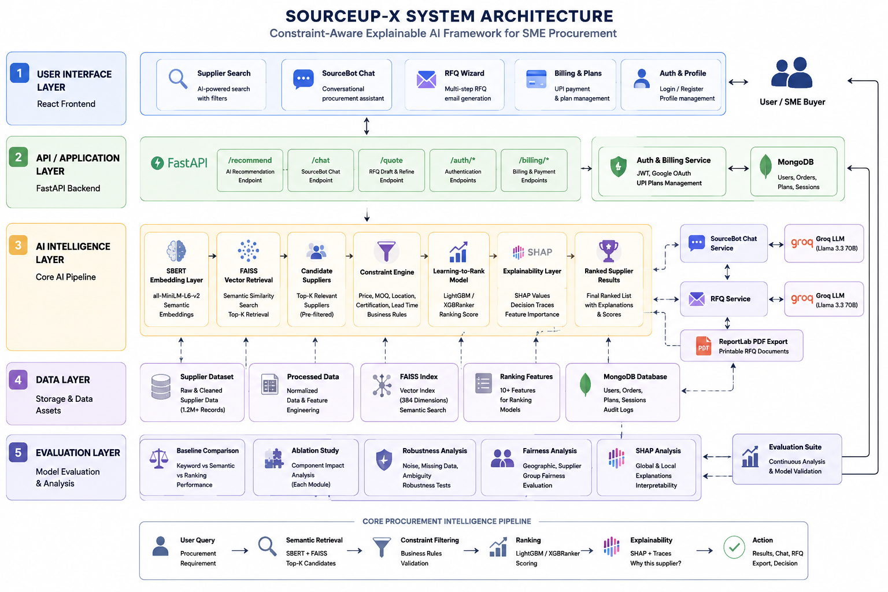

╔══════════════════════════════════════════════════════════════════════════════╗
║ ║
║ ███████╗ ██████╗ ██╗ ██╗██████╗ ██████╗███████╗██╗ ██╗██████╗ ║
║ ██╔════╝██╔═══██╗██║ ██║██╔══██╗██╔════╝██╔════╝██║ ██║██╔══██╗ ║
║ ███████╗██║ ██║██║ ██║██████╔╝██║ █████╗ ██║ ██║██████╔╝ ║
║ ╚════██║██║ ██║██║ ██║██╔══██╗██║ ██╔══╝ ██║ ██║██╔═══╝ ║
║ ███████║╚██████╔╝╚██████╔╝██║ ██║╚██████╗███████╗╚██████╔╝██║ ║
║ ╚══════╝ ╚═════╝ ╚═════╝ ╚═╝ ╚═╝ ╚═════╝╚══════╝ ╚═════╝ ╚═╝ ║
║ ║
║ ╔══════════════════════════════════════════════════════════════════════╗ ║
║ ║ A Constraint-Aware Explainable AI Framework for Semantic Supplier ║ ║
║ ║ Discovery and Ranking in SME Procurement ║ ║
║ ╚══════════════════════════════════════════════════════════════════════╝ ║
║ ║
╚══════════════════════════════════════════════════════════════════════════════╝
# SOURCEUP-X


## A Constraint-Aware Explainable AI Framework for Semantic Supplier Discovery and Ranking in SME Procurement


## Abstract

Supplier discovery remains a major challenge for Small and Medium Enterprises (SMEs), where procurement decisions often rely on keyword search, manual filtering, and subjective vendor selection. Traditional procurement platforms provide limited support for semantic requirement matching, transparent recommendation reasoning, and procurement-specific constraint handling.

This work presents SourceUp-X, a constraint-aware procurement intelligence framework that combines semantic retrieval, learning-to-rank techniques, explainable artificial intelligence, and conversational procurement assistance. The proposed architecture integrates Sentence-BERT embeddings, FAISS vector retrieval, procurement-aware feature engineering, ranking models, SHAP-based explainability, and interactive RFQ generation workflows.

Experimental evaluation demonstrates improvements in ranking quality, recommendation consistency, robustness under noisy supplier data, and interpretability compared with traditional retrieval baselines. The framework illustrates how explainable semantic ranking can support transparent and efficient supplier discovery for SMEs.
## Research Motivation

Traditional procurement systems rely heavily on keyword-based search, manual supplier filtering, static ranking logic, and opaque recommendation processes. These approaches struggle when users describe requirements semantically, when supplier metadata is incomplete, or when decision-makers need to understand why one supplier is recommended over another.

SourceUp-X explores whether procurement can be modeled as a constraint-aware semantic ranking problem using modern AI retrieval, ranking, and explainability techniques. The goal is to make supplier discovery more transparent, scalable, and usable for SMEs that do not have access to enterprise procurement intelligence infrastructure.

## Why This Project Matters

SMEs often lack access to intelligent procurement tools available to large enterprises. Supplier discovery is still frequently performed through manual search, spreadsheets, fragmented directories, and subjective vendor shortlisting.

SourceUp-X explores how explainable AI and semantic ranking systems can make procurement:

- more transparent,
- more efficient,
- more evidence-driven,
- and more accessible for smaller businesses.
## Research Questions

This work investigates the following research questions:

RQ1: Can semantic retrieval improve supplier discovery compared to keyword-based procurement search?

RQ2: How much do procurement-specific ranking features contribute to recommendation quality?

RQ3: Can explainable AI improve transparency and trust in supplier recommendations?

RQ4: How robust is the proposed framework under incomplete or noisy supplier metadata?

RQ5: Does the ranking process introduce measurable supplier exposure imbalance?
## Main Contributions

This paper makes the following contributions:

1. A semantic supplier retrieval framework using SBERT and FAISS.
2. A constraint-aware ranking architecture for procurement recommendations.
3. Integration of learning-to-rank models for supplier prioritization.
4. SHAP-based explainability for transparent procurement decisions.
5. A conversational procurement assistant for requirement refinement.
6. A comprehensive evaluation including baseline comparison, ablation analysis, robustness testing, and fairness assessment.
7. An end-to-end prototype demonstrating practical deployment feasibility.
## Core Capabilities

| Area | Capability |
| --- | --- |
| Supplier Search | Semantic supplier retrieval using SBERT and FAISS |
| Ranking | Constraint-aware ranking with procurement features and ranker models |
| Explainability | SHAP summaries, decision traces, and feature-level explanations |
| Conversational AI | SourceBot chat assistant powered by Groq LLMs |
| RFQ Workflow | AI-generated RFQ drafts, refinement, email export, PDF download, and print-ready RFQs |
| Authentication | Email/password login, JWT sessions, Google OAuth callback flow |
| Billing | UPI-based plan upgrade flow with orders and verification |
| Persistence | MongoDB-backed users, orders, and application data |
| Evaluation | Baselines, ablations, robustness, sensitivity, fairness, and SHAP analysis |

## Example Workflow

1. A user submits a procurement query, such as "ISO certified packaging suppliers in India under USD 2".
2. SBERT converts the query and supplier records into semantic embeddings.
3. FAISS retrieves candidate suppliers from the vector index.
4. Procurement constraints filter or penalize invalid candidates.
5. Ranking features are computed for candidate suppliers.
6. The ranker scores and orders suppliers by procurement relevance.
7. SHAP and decision-trace modules explain why suppliers were recommended.
8. SourceBot helps the user refine the procurement intent conversationally.
9. The RFQ wizard drafts a supplier communication email.
10. The RFQ can be exported as a formal print-ready PDF.

## Dataset

The evaluation dataset consists of supplier records collected from public business directories and procurement-related sources.

The dataset includes attributes such as:

- Supplier name
- Product category
- Location
- MOQ
- Certifications
- Lead time
- Supplier experience

Data preprocessing included cleaning, normalization, duplicate removal, and feature generation for ranking model training.

## System Architecture



SourceUp-X follows a layered architecture that separates the user experience, API services, AI intelligence modules, persistence layer, and evaluation workflows. This structure makes the project easier to explain as both a working web application and a research-driven procurement recommendation framework.

### 1. User Interface Layer

The React frontend is the interaction layer for SME buyers. It provides supplier search, SourceBot chat, authentication, billing, and RFQ generation in a single-page application. Users can search for suppliers, inspect ranked results, open AI-assisted chat, generate RFQ emails, export formal RFQ PDFs, and manage their plan status.

Key frontend modules include:

- `AuthModal.jsx` for login, registration, and Google login initiation.
- `SearchResultsView.jsx` for supplier search and ranked results.
- `ChatTab.jsx` for SourceBot conversational procurement assistance.
- `QuoteModal.jsx` for RFQ generation, refinement, PDF download, and printing.
- `BillingModal.jsx` for UPI-based plan upgrade workflow.
- `OAuthCallback.jsx` for Google OAuth token handling.

### 2. API and Application Layer

The FastAPI backend exposes the system capabilities through REST endpoints. It acts as the central coordination layer between the frontend, AI models, database, and external services. Each major workflow is separated into an API module:

- `recommend.py` handles supplier retrieval, ranking, constraints, what-if analysis, and comparison.
- `chat.py` powers SourceBot conversations using Groq LLMs.
- `quote.py` generates RFQ drafts, refines drafts, and exports print-ready PDF documents.
- `auth.py` manages registration, login, JWT authentication, Google OAuth, billing plans, and UPI order verification.

This layer receives user requests, validates input with Pydantic models, calls the relevant service or model pipeline, and returns structured JSON or PDF responses.

### 3. Procurement Intelligence Layer

The recommendation engine is the core research component of SourceUp-X. It converts procurement search into a multi-stage ranking pipeline:

```text
User Query -> SBERT Embedding -> FAISS Retrieval -> Constraint Filtering -> Ranking -> SHAP Explanation -> Ranked Results
```

The pipeline works as follows:

1. The user submits a procurement query.
2. SBERT generates semantic embeddings for the query and supplier text.
3. FAISS retrieves semantically relevant supplier candidates.
4. The constraint engine applies business filters such as price, MOQ, location, certification, lead time, and supplier experience.
5. Ranking models score candidates using procurement-specific features.
6. SHAP and decision-trace services explain why suppliers were ranked highly.
7. The frontend displays ranked suppliers with supporting decision context.

This design moves the system beyond keyword matching and allows supplier discovery to consider semantic similarity, business constraints, and explainability together.

### 4. Conversational and RFQ Intelligence Layer

SourceBot and the RFQ wizard use Groq-powered LLM workflows to support procurement communication. SourceBot helps users refine procurement needs conversationally, while the RFQ wizard converts supplier and requirement details into professional supplier outreach.

The RFQ workflow supports:

- AI-generated RFQ email drafts.
- tone selection and refinement,
- copy-to-email workflow,
- formal PDF generation with ReportLab,
- print-ready signature blocks for offline supplier communication.

### 5. Data and Persistence Layer

SourceUp-X uses multiple storage components depending on the type of data:

- MongoDB stores users, authentication metadata, billing orders, and plan state.
- FAISS stores vector indexes for semantic supplier retrieval.
- CSV/data pipeline outputs store cleaned supplier records and model-ready features.
- Optional Redis/Memurai support can be used for conversational session memory.

This separation keeps transactional application data separate from retrieval indexes and research evaluation artifacts.

### 6. Evaluation and Research Layer

The evaluation layer validates the recommendation system using baseline comparison, ablation studies, robustness testing, fairness analysis, and explainability analysis. These workflows are implemented through scripts under `eval/`, `evaluation/`, and generated plots under `data/eval/plots/`.

This layer answers research questions such as:

- Does semantic retrieval improve over keyword retrieval?
- How much does each pipeline component contribute?
- Does the ranking remain stable under noisy supplier data?
- Are recommendations explainable at the feature level?
- Does ranking behavior create supplier exposure imbalance?

Together, these layers position SourceUp-X as a full-stack AI procurement platform with a research-backed recommendation pipeline rather than a simple supplier search interface.

## Technical Stack

| Layer | Technology |
| --- | --- |
| Frontend | React, React Router, CSS-in-JS style tokens |
| Backend | FastAPI, Pydantic, Uvicorn |
| Authentication | JWT, bcrypt/passlib, Google OAuth redirect flow |
| Database | MongoDB with Motor async driver |
| Vector Search | FAISS |
| Embeddings | Sentence-BERT / all-MiniLM-L6-v2 |
| Ranking | LightGBM, XGBoost ranking workflows |
| Explainability | SHAP |
| LLM Assistance | Groq LLM APIs |
| PDF Generation | ReportLab |
| Optional Memory | Redis / Memurai |
| Evaluation | pandas, NumPy, scikit-learn, matplotlib, seaborn |

## Evaluation Methodology

The system was evaluated using ranking quality metrics, baseline comparison, ablation studies, robustness testing under noisy supplier data, and fairness-oriented geographic analysis.

Evaluation metrics include:

- NDCG@K
- MAP
- MRR
- Precision@K
- Kendall Tau
- ranking stability under perturbation
- exposure distribution across supplier groups

## Baseline Comparison

SourceUp-X was benchmarked against keyword-based retrieval, cosine similarity retrieval, non-ranked semantic retrieval, and traditional filtering approaches. The evaluation is designed to test whether semantic retrieval combined with learning-to-rank improves supplier recommendation quality and ranking consistency.


## Ablation Study

To evaluate component importance, multiple system variants were tested by selectively removing semantic retrieval, ranking models, explainability layers, and constraint filters. Performance degradation across these variants validates the contribution of each module within the procurement intelligence pipeline.


## Robustness Analysis

The system was evaluated under noisy procurement conditions including incomplete supplier metadata, inconsistent product naming, noisy labels, and semantic ambiguity. Stability analysis helps measure whether ranking behavior remains reliable when procurement data resembles real-world supplier directories.


## Fairness and Responsible AI

SourceUp-X includes preliminary fairness-aware evaluation to analyze whether ranking behavior disproportionately favors metro suppliers, dominant vendors, or high-visibility entities. The objective is not to enforce artificial parity, but to make supplier exposure measurable, inspectable, and open to responsible procurement policy decisions.

### Fairness Evaluation

Supplier exposure was analyzed across geographic supplier groups to identify potential ranking bias.

Results indicate that the ranking framework maintains balanced exposure distributions while preserving recommendation quality.

Fairness evaluation is intended as a transparency mechanism rather than a post-processing correction strategy.


## Explainability

Explainability is treated as a core procurement requirement rather than a decorative feature. SHAP analysis and decision traces help users understand the factors behind supplier ranking decisions, such as price match, certification match, lead time, location constraints, experience, and semantic similarity.

### Example Explanation

Recommended Supplier A received a high ranking due to:

- Strong semantic similarity
- Certification match
- Competitive pricing
- Low lead time

SHAP values quantify the contribution of each factor to the final ranking score.


## Experimental Results

| Metric | Score |
|----------|---------|
| NDCG@5 | 0.861 |
| NDCG@10 | 0.874 |
| MAP | 0.861 |
| Precision@5 | 0.820 |
| Kendall Tau | 0.730 |
| Scale Indicator | Value |
| --- | ---: |
| Raw supplier records | 1.2M+ |
| Clean supplier records | 828k+ |
| FAISS embedding dimension | 384 |
| Training pairs | 7,500+ |
| Ranking feature count | 10 |

Note: Values represent the current research prototype evaluation snapshot and may vary with dataset version, feature generation, and model configuration.

The proposed framework consistently outperformed keyword retrieval and non-ranked semantic retrieval baselines across all ranking metrics.

## Application Features

### Smart Supplier Search

- Semantic query understanding with SBERT.
- FAISS candidate retrieval for scalable search.
- Constraint filters for price, MOQ budget, location, certification, lead time, and supplier experience.
- Ranked supplier cards with decision-support metadata.

### SourceBot Conversational Assistant

- Groq-powered procurement chat interface.
- Supplier-aware responses and procurement refinement.
- Session memory support through Redis/Memurai when configured.
- Natural-language assistance for search intent clarification.

### RFQ Wizard and PDF Export

- Multi-step RFQ draft generation.
- Tone controls: formal, semi-formal, and direct.
- AI refinement for shorter, more formal, or requirement-specific drafts.
- Copy-to-clipboard and mail client export.
- Formal RFQ PDF export using ReportLab.
- Print-ready signature block for supplier communication.

### Authentication and OAuth

- Email/password registration and login.
- Password hashing with bcrypt.
- JWT-based session authentication.
- Google OAuth login route and callback handling.
- MongoDB-backed user profiles with plan metadata.

### Billing and Plans

- Free, Pro, and Enterprise plan model.
- UPI order creation and UTR verification flow.
- MongoDB-backed billing order audit trail.
- Plan-aware UI state.

## API Endpoints

### Core Services

| Method | Endpoint | Description |
| --- | --- | --- |
| POST | `/recommend` | Retrieve and rank suppliers using semantic search and constraints |
| POST | `/what-if` | Simulate how constraint changes affect recommendations |
| POST | `/compare` | Compare suppliers or recommendation scenarios |
| GET | `/stats` | Return supplier and recommendation system statistics |
| POST | `/chat` | SourceBot conversational procurement assistant |
| POST | `/quote/draft` | Generate an RFQ email draft |
| POST | `/quote/refine` | Refine an existing RFQ draft |
| POST | `/quote/export-pdf` | Export a formal printable RFQ PDF |
| GET | `/health` | Application health check |

### Authentication and Billing

| Method | Endpoint | Description |
| --- | --- | --- |
| POST | `/auth/register` | Register a new user with hashed password storage |
| POST | `/auth/login` | Login and receive a JWT |
| GET | `/auth/me` | Return current authenticated user profile |
| GET | `/auth/google/login` | Start Google OAuth login |
| GET | `/auth/google/callback` | Handle Google OAuth callback |
| POST | `/auth/demo-login` | Create or retrieve a demo Pro user |
| GET | `/auth/billing/plans` | List pricing plans |
| POST | `/auth/billing/order` | Create a UPI payment order |
| POST | `/auth/billing/verify` | Verify UTR and upgrade user plan |

## Request Examples

### Supplier Recommendation

```json
{
  "product": "biodegradable food containers",
  "max_price": 2.0,
  "moq_budget": 500,
  "location": "India",
  "location_mandatory": false,
  "certification": "FDA",
  "max_lead_time": 30,
  "min_years_experience": 3,
  "enable_explanations": true,
  "enable_what_if": false,
  "top_k": 10
}
```

### RFQ Draft

```json
{
  "supplier_name": "Acme Packaging Co.",
  "product_name": "Biodegradable food containers",
  "quantity": 5000,
  "target_price": 1.5,
  "delivery_location": "Mumbai, India",
  "required_certification": "FDA",
  "lead_time_days": 30,
  "buyer_company": "Example Retail Pvt Ltd",
  "buyer_name": "Procurement Team",
  "additional_notes": "Preferred tone: formal."
}
```

### RFQ PDF Export

```json
{
  "subject": "Request for Quotation - Biodegradable food containers",
  "body": "Dear Supplier Team,\n\nPlease provide a formal quotation...",
  "tone": "formal",
  "supplier_name": "Acme Packaging Co.",
  "product_name": "Biodegradable food containers",
  "quantity": 5000,
  "target_price": 1.5,
  "delivery_location": "Mumbai, India",
  "required_certification": "FDA",
  "lead_time_days": 30,
  "buyer_name": "Procurement Team",
  "buyer_company": "Example Retail Pvt Ltd",
  "buyer_email": "procurement@example.com"
}
```

## MongoDB Collections

### `users`

```json
{
  "email": "user@company.com",
  "hashed_password": "$2b$12$...",
  "plan": "free",
  "company": "Company Name",
  "created_at": "2026-01-01T00:00:00",
  "is_demo": false,
  "auth_provider": "email",
  "full_name": "",
  "avatar_url": ""
}
```

### `orders`

```json
{
  "order_id": "uuid-v4",
  "email": "user@company.com",
  "plan": "pro",
  "amount": 999,
  "created_at": "2026-01-01T00:00:00",
  "verified": false,
  "upi_transaction_id": null,
  "verified_at": null
}
```

## Project Structure

```text
SourceUp/
|-- backend/
|   |-- app/
|   |   |-- api/
|   |   |   |-- auth.py              # Auth, Google OAuth, billing, JWT
|   |   |   |-- chat.py              # SourceBot conversational assistant
|   |   |   |-- quote.py             # RFQ draft, refine, PDF export
|   |   |   |-- recommend.py         # Supplier recommendation APIs
|   |   |-- database/
|   |   |   |-- mongodb.py           # Motor async MongoDB client
|   |   |-- models/
|   |   |   |-- retriever.py         # FAISS retrieval
|   |   |   |-- ranker.py            # Ranking logic
|   |   |   |-- train_ranker.py      # Ranker training workflow
|   |   |-- services/
|   |   |   |-- explanation.py       # SHAP explanations
|   |   |   |-- decision_trace.py    # Recommendation traces
|   |   |   |-- what_if_simulator.py # What-if analysis
|   |   |-- utils/
|   |   |   |-- security.py          # bcrypt and JWT helpers
|   |   |   |-- logging_config.py    # Logging setup
|   |   |-- main.py                 # FastAPI app entrypoint
|-- frontend-react/
|   |-- src/
|   |   |-- App.js                  # React app shell and routes
|   |   |-- components/
|   |   |   |-- AuthModal.jsx        # Login, register, Google login
|   |   |   |-- SearchResultsView.jsx# Supplier search UI
|   |   |   |-- ChatTab.jsx          # SourceBot UI
|   |   |   |-- QuoteModal.jsx       # RFQ wizard and PDF export
|   |   |   |-- BillingModal.jsx     # UPI billing flow
|   |   |-- pages/
|   |   |   |-- OAuthCallback.jsx    # Google OAuth callback page
|   |   |-- utils/
|   |   |   |-- api.js               # Frontend API client
|-- sourcebot/
|   |-- memory/session.py           # Redis/Memurai memory
|   |-- nlu/parser.py               # Rule-based NLU parsing
|-- pipeline/                       # Data cleaning and FAISS indexing
|-- features/                       # Feature engineering
|-- eval/                           # Evaluation scripts
|-- evaluation/                     # Metric utilities
|-- assets/                         # Architecture and evaluation images
|-- data/eval/plots/                # Generated evaluation plots
|-- config.py                       # Centralized configuration
|-- EXECUTION_GUIDE.md              # Detailed execution sequence
|-- README.md
```

## Environment Variables

Create a `.env` file in the project root.

```env
# Project
SOURCEUP_ROOT=D:/PycharmProjects/SourceUp

# LLM
GROQ_API_KEY=your_groq_api_key

# MongoDB
MONGODB_URI=mongodb://localhost:27017
MONGODB_DB=sourceup

# JWT / auth
SECRET_KEY=replace_with_a_long_random_secret

# Google OAuth
GOOGLE_CLIENT_ID=your_google_client_id
GOOGLE_CLIENT_SECRET=your_google_client_secret
GOOGLE_REDIRECT_URI=http://localhost:8000/auth/google/callback
FRONTEND_URL=http://localhost:3000

# UPI billing
UPI_ID=yourname@upi

# Demo user
DEMO_EMAIL=demo@sourceup.com
DEMO_PASSWORD=demopass123
DEMO_PLAN=pro

# Optional Redis / Memurai
REDIS_HOST=localhost
REDIS_PORT=6379
```

Create `frontend-react/.env`.

```env
REACT_APP_API_URL=http://localhost:8000
```

## Demo Access

```text
Email: demo@sourceup.com
Password: demopass123
```

The application also supports one-click demo access through `POST /auth/demo-login`.

## Installation

### Python Dependencies

If a project-specific requirements file is not present, install the core dependencies manually:

```bash
pip install fastapi uvicorn python-dotenv groq httpx reportlab
pip install sentence-transformers faiss-cpu lightgbm xgboost
pip install pandas numpy scikit-learn scipy matplotlib seaborn shap
pip install motor pymongo python-jose[cryptography] passlib[bcrypt]
pip install redis langchain-groq langchain-core
```

### Frontend Dependencies

```bash
cd frontend-react
npm install
```

## How to Run

### Backend

```bash
python -m uvicorn backend.app.main:app --reload --port 8000
```

Backend runs at:

```text
http://localhost:8000
```

API documentation:

```text
http://localhost:8000/docs
```

### Frontend

```bash
cd frontend-react
npm start
```

Frontend usually runs at:

```text
http://localhost:3000
```

If port `3000` is already in use, React may start on `3001`. In that case, update `FRONTEND_URL` and backend CORS origins accordingly.

## Data and Training Pipeline

```bash
# Clean and normalize supplier data
python pipeline/run_all.py

# Build ranking features
python features/feature_builder.py

# Train ranking model
python backend/app/models/train_ranker.py

# Run evaluation modules
python eval/baselines.py
python eval/ablation.py
python eval/stability.py
python eval/fairness.py
python eval/shap_analysis.py
```

## Plans and Billing Model

| Feature | Free | Pro | Enterprise |
| --- | --- | --- | --- |
| Supplier searches | Limited | Unlimited | Unlimited |
| SourceBot chat | Yes | Yes | Yes |
| RFQ wizard | Limited | Yes | Yes |
| RFQ PDF export | Limited | Yes | Yes |
| Decision traces | Limited | Yes | Yes |
| What-if scenarios | No | Yes | Yes |
| API access | No | No | Yes |
| Priority support | No | No | Yes |

UPI payment verification is implemented as a prototype order and UTR verification flow.

## Security

- Passwords are hashed using bcrypt.
- JWT tokens protect authenticated routes.
- MongoDB unique indexes prevent duplicate user records.
- Google OAuth login is supported through backend redirect routes.
- Billing verification requires authenticated user context.
- CORS is configured for local development origins.

Security note: this is a research prototype. Production deployment should rotate secrets, remove test credentials, harden CORS, enforce HTTPS, add rate limiting, and use a production-grade payment provider.

## Limitations

Current limitations include:

- synthetic or semi-simulated procurement datasets,
- limited real-world procurement feedback loops,
- absence of live ERP or supplier verification integration,
- limited payment automation beyond UPI proof submission,
- limited production hardening for authentication and billing,
- no large-scale online A/B testing with real procurement users.

The project is intended as a research prototype and full-stack proof of concept rather than a production procurement platform.


## Threats to Validity

Several limitations should be considered:

- Use of semi-synthetic procurement datasets.
- Limited availability of real procurement feedback.
- Absence of large-scale industry deployment.
- Potential domain-specific ranking bias.

Future work will focus on real-world procurement partnerships and online evaluation.

## Future Work

- Real procurement feedback loops for learning-to-rank improvement.
- Supplier reliability prediction using time-series behavior.
- Fairness-aware geographic re-ranking policies.
- Multi-objective Pareto supplier recommendations.
- RAG-based procurement assistant with document upload.
- ERP, CRM, and accounting integrations.
- Certified e-signature workflow for legally binding RFQs.
- Production payment gateway integration.
- Role-based access control for procurement teams.

## Citation

If you use this work in research, please cite:

```bibtex
@misc{sourceupx2026,
  title={SourceUp-X: Constraint-Aware Explainable AI Framework for SME Procurement},
  author={Somas Kandan},
  year={2026},
  note={IEEE-style research prototype}
}
```

## License

This project is released under the MIT License.

## Author

SourceUp-X is a final-year AI research project focused on constraint-aware explainable procurement intelligence for SMEs.

It is not only a supplier search interface. It is a full-stack AI procurement framework combining semantic retrieval, learning-to-rank, explainable AI, conversational interfaces, authentication, billing, and formal RFQ generation into one research-driven system.
